# 2026 深圳美食｜12 間必吃深圳餐廳推薦：酸菜魚、椰子雞、海鮮、雞煲、火鍋全收錄
> 原文链接: https://tw.trip.com/blog/top-10-restaurants-you-cannot-miss-in-shenzhen/

---

-   [住宿](https://tw.trip.com/hotels/?locale=zh-TW&curr=TWD "住宿")
-   [機票](https://tw.trip.com/flights/?locale=zh-TW&curr=TWD "機票")
-   [火車票](https://tw.trip.com/trains/?locale=zh-TW&curr=TWD "火車票")
-   租車＆機場接送
    -   [租車](https://tw.trip.com/carhire/?channelid=14409&locale=zh-TW&curr=TWD)
    -   [機場接送](https://tw.trip.com/airport-transfers/?locale=zh-TW&curr=TWD)
-   [門票/體驗](https://tw.trip.com/things-to-do/?locale=zh-TW&curr=TWD "門票/體驗")
    -   [門票/體驗](https://tw.trip.com/things-to-do/?locale=zh-TW&curr=TWD)
    -   [eSIM & SIM](https://tw.trip.com/sale/w/10229/esim.html?locale=zh-TW&curr=TWD)
-   [機＋酒](https://tw.trip.com/packages/?sourceFrom=IBUBundle_home&locale=zh-TW&curr=TWD "機＋酒")

App

TWD

客服支援

[尋找訂單](https://tw.trip.com/passport/ordersearch/?locale=zh-TW&curr=TWD)

登入／註冊

2026全球旅遊攻略推薦

[大洋洲](https://tw.trip.com/blog/tag-oceania-2453/?locale=zh-TW&curr=TWD "大洋洲")

[澳大利亞](https://tw.trip.com/blog/tag-australia-2454/?locale=zh-TW&curr=TWD "澳大利亞")[紐西蘭](https://tw.trip.com/blog/tag-new-zealand-2455/?locale=zh-TW&curr=TWD "紐西蘭")[帛琉](https://tw.trip.com/blog/tag-palau-2457/?locale=zh-TW&curr=TWD "帛琉")

[亞洲](https://tw.trip.com/blog/tag-asia-2459/?locale=zh-TW&curr=TWD "亞洲")

[日本](https://tw.trip.com/blog/tag-japan-2461/?locale=zh-TW&curr=TWD "日本")[朝鮮](https://tw.trip.com/blog/tag-democratic-people-s-republic-of-korea-2462/?locale=zh-TW&curr=TWD "朝鮮")[中國](https://tw.trip.com/blog/tag-china-2463/?locale=zh-TW&curr=TWD "中國")[新加坡](https://tw.trip.com/blog/tag-singapore-2464/?locale=zh-TW&curr=TWD "新加坡")[印度](https://tw.trip.com/blog/tag-india-2466/?locale=zh-TW&curr=TWD "印度")[菲律賓](https://tw.trip.com/blog/tag-philippines-2467/?locale=zh-TW&curr=TWD "菲律賓")[泰國](https://tw.trip.com/blog/tag-thailand-2471/?locale=zh-TW&curr=TWD "泰國")[印尼](https://tw.trip.com/blog/tag-indonesia-2472/?locale=zh-TW&curr=TWD "印尼")[越南](https://tw.trip.com/blog/tag-vietnam-2473/?locale=zh-TW&curr=TWD "越南")[柬埔寨](https://tw.trip.com/blog/tag-cambodia-2477/?locale=zh-TW&curr=TWD "柬埔寨")[馬來西亞](https://tw.trip.com/blog/tag-malaysia-2479/?locale=zh-TW&curr=TWD "馬來西亞")[韓國](https://tw.trip.com/blog/tag-south-korea-2480/?locale=zh-TW&curr=TWD "韓國")[斯里蘭卡](https://tw.trip.com/blog/tag-sri-lanka-2481/?locale=zh-TW&curr=TWD "斯里蘭卡")[緬甸](https://tw.trip.com/blog/tag-myanmar-2484/?locale=zh-TW&curr=TWD "緬甸")[阿拉伯聯合大公國](https://tw.trip.com/blog/tag-united-arab-emirates-2486/?locale=zh-TW&curr=TWD "阿拉伯聯合大公國")[不丹](https://tw.trip.com/blog/tag-bhutan-2569/?locale=zh-TW&curr=TWD "不丹")

[歐洲](https://tw.trip.com/blog/tag-europe-2468/?locale=zh-TW&curr=TWD "歐洲")

[德國](https://tw.trip.com/blog/tag-germany-2495/?locale=zh-TW&curr=TWD "德國")[冰島](https://tw.trip.com/blog/tag-iceland-2496/?locale=zh-TW&curr=TWD "冰島")[法國](https://tw.trip.com/blog/tag-france-2499/?locale=zh-TW&curr=TWD "法國")[義大利](https://tw.trip.com/blog/tag-italy-2500/?locale=zh-TW&curr=TWD "義大利")[西班牙](https://tw.trip.com/blog/tag-spain-2502/?locale=zh-TW&curr=TWD "西班牙")[希臘](https://tw.trip.com/blog/tag-greece-2504/?locale=zh-TW&curr=TWD "希臘")[瑞士](https://tw.trip.com/blog/tag-switzerland-2505/?locale=zh-TW&curr=TWD "瑞士")[英國](https://tw.trip.com/blog/tag-united-kingdom-2507/?locale=zh-TW&curr=TWD "英國")[丹麥](https://tw.trip.com/blog/tag-denmark-2510/?locale=zh-TW&curr=TWD "丹麥")[芬蘭](https://tw.trip.com/blog/tag-finland-2519/?locale=zh-TW&curr=TWD "芬蘭")[保加利亞](https://tw.trip.com/blog/tag-bulgaria-2521/?locale=zh-TW&curr=TWD "保加利亞")[匈牙利](https://tw.trip.com/blog/tag-hungary-2523/?locale=zh-TW&curr=TWD "匈牙利")[波士尼亞與赫塞哥維納](https://tw.trip.com/blog/tag-bosnia-and-herzegovina-2528/?locale=zh-TW&curr=TWD "波士尼亞與赫塞哥維納")

[北美洲](https://tw.trip.com/blog/tag-north-america-2530/?locale=zh-TW&curr=TWD "北美洲")

[墨西哥](https://tw.trip.com/blog/tag-mexico-2532/?locale=zh-TW&curr=TWD "墨西哥")[加拿大](https://tw.trip.com/blog/tag-canada-2533/?locale=zh-TW&curr=TWD "加拿大")[美國](https://tw.trip.com/blog/tag-united-states-2534/?locale=zh-TW&curr=TWD "美國")[聖文森特和格林納丁斯](https://tw.trip.com/blog/tag-city-11984/?locale=zh-TW&curr=TWD "聖文森特和格林納丁斯")

[非洲](https://tw.trip.com/blog/tag-africa-2555/?locale=zh-TW&curr=TWD "非洲")

[加納](https://tw.trip.com/blog/tag-ghana-2564/?locale=zh-TW&curr=TWD "加納")

[旅行體驗](https://tw.trip.com/blog/tag-travel-experiences-2583/?locale=zh-TW&curr=TWD "旅行體驗")

[探索自然](https://tw.trip.com/blog/tag-explore-nature-2584/?locale=zh-TW&curr=TWD "探索自然")[人文歷史](https://tw.trip.com/blog/tag-cultural-history-2585/?locale=zh-TW&curr=TWD "人文歷史")[休閒度假](https://tw.trip.com/blog/tag-leisurely-vacation-2586/?locale=zh-TW&curr=TWD "休閒度假")[家庭出遊](https://tw.trip.com/blog/tag-family-friendly-2587/?locale=zh-TW&curr=TWD "家庭出遊")[戶外運動](https://tw.trip.com/blog/tag-outdoor-recreation-2588/?locale=zh-TW&curr=TWD "戶外運動")[購物](https://tw.trip.com/blog/tag-shopping-2589/?locale=zh-TW&curr=TWD "購物")[美食](https://tw.trip.com/blog/tag-gourmet-food-2590/?locale=zh-TW&curr=TWD "美食")[飯店](https://tw.trip.com/blog/tag-hotels-2591/?locale=zh-TW&curr=TWD "飯店")[自駕遊](https://tw.trip.com/blog/tag-driving-2620/?locale=zh-TW&curr=TWD "自駕遊")[水上活動](https://tw.trip.com/blog/tag-water-recreation-2627/?locale=zh-TW&curr=TWD "水上活動")[優惠活動](https://tw.trip.com/blog/tag-promotion-2804/?locale=zh-TW&curr=TWD "優惠活動")[飛行體驗](https://tw.trip.com/blog/tag-inflight-tips-2805/?locale=zh-TW&curr=TWD "飛行體驗")[綠色旅遊](https://tw.trip.com/blog/tag-green-travel-2806/?locale=zh-TW&curr=TWD "綠色旅遊")[旅遊資訊](https://tw.trip.com/blog/tag-travel-tips-3138/?locale=zh-TW&curr=TWD "旅遊資訊")[公共假日](https://tw.trip.com/blog/tag-holiday-calendar-3139/?locale=zh-TW&curr=TWD "公共假日")

# 深圳美食2026 12 間必吃深圳餐廳推薦：酸菜魚、椰子雞、海鮮、雞煲、火鍋全收錄

__

2026年5月深圳自由行旅遊攻略參考（每日更新）

【深圳旅遊攻略】

-   深圳目前為5月29日
-   5月29日深圳雷擊伴隨陣雨，氣溫25℃~34℃，未來一週（5月29日-6月4日）24℃~34℃
-   當地使用貨幣為CNY, 5月29日與台灣使用貨幣的匯率約為0.22

【深圳旅遊熱點】

-   六一兒童節免費入園！廣東多家樂園推出親子優惠｜地點：廣州長隆度假區｜時間：2026-05-30 00:00:00-2026-06-04 00:00:00
-   無人機新規定來了！你的無人機還能飛嗎？｜地點：中國

【Trip.com用戶關注較多的深圳餐厅參考】

1.必試美食:

1.  瀾·海景音樂餐吧LALALAND: 全開放海景露台愜意舒適，西式餐點形味俱佳, 最近有 100+ 次瀏覽
2.  長安亭院火鍋（深圳總店）: 身歷其境體驗大唐盛世，重慶火鍋麻辣鮮香, 最近有 100+ 次瀏覽

2.高級餐廳:

1.  胤呈: 由歐國慶主廚主理, 希爾頓集團旗下高級餐廳
2.  珍庭潮州菜（卓悅中心店）: 由主廚徐振坤主理, 位於卓悦中心

以上資料來自5月22日-5月29日Trip.com平台資料庫及用户真实行為與评价，由本文作者Arrow Chan實地核實修訂，仅作參考

[Arrow Chan](https://tw.trip.com/travel-guide/personal-home/0C56FD9C31308DD4427BA5623C873C46?blogs)2026 年 5 月 24 日__332,045__26

作為Trip.com的旅行內容創作者，自2019年10月11日起於平台發佈出行相關內容。出行經歷涵蓋中國、日本、韓國等全球15個國家，主要整理休閒度假、人文歷史、家庭出遊等旅行主題的實用資訊。文章內容基於作者實際出行經歷，並結合Trip平台用戶數據及官方資料進行交叉核對，供旅客規劃行程時參考。截至2026年05月29日，該帳號共發佈Blog202篇，累計獲得21.9M次瀏覽。[了解更多關於Arrow Chan](https://tw.trip.com/travel-guide/personal-home/0C56FD9C31308DD4427BA5623C873C46?blogs)

顯示更多

目錄

-   深圳美食 Top 12
-   港人必讀深圳美食貼士
    -   必裝「搵食」App：告別盲目排隊
    -   支付與網絡：順暢結帳不尷尬
    -   2026 必食主題清單（港人最愛）
    -   香港旅客隱藏貼士（避坑指引）
-   深圳美食｜祿鼎記
-   深圳美食｜太二酸菜魚
-   深圳美食｜探魚
-   深圳美食｜汕頭八合裏海記牛肉店
-   深圳美食｜潤園四季椰子雞
-   深圳美食｜義和雅苑
-   深圳美食｜卓記米粉
-   深圳美食｜海極鮮蒸汽美食坊
-   深圳美食｜貝樂爺小海鮮火鍋·燒烤
-   深圳美食｜仙豆糕
-   深圳美食｜木屋燒烤
-   深圳美食｜洪大廚雞煲
-   深圳美食｜深圳住宿推薦
    -   深圳南頭有熊酒店
    -   深圳康萊德酒店
    -   深圳益田威斯汀酒店
    -   深圳鵬瑞萊佛士酒店
    -   深圳若璽酒店（南山科技園店）
-   深圳美食常見問題
    -   第一次去深圳，必吃的深圳美食有哪些？
    -   深圳美食的價格大概是多少？
    -   從香港去吃深圳美食方便嗎？
    -   深圳哪個地區的美食最多？

顯示更多__

想一次攻略所有深圳美食？本篇文章 Trip.com 盤點 12 間深圳必吃餐廳：酸菜魚、椰子雞、蒸海鮮、雞煲、火鍋與甜點通通有。附上餐廳資訊與訂位時段建議，搭配深圳住宿精選與交通攻略，幫你從早餐到宵夜吃好吃滿。

## 台北__深圳

出發日期：2026-06-12

未來30日內最低價

TWD7,940

查看詳情

## 香港__深圳

單程|14分鐘|電子車票

時間最短

最低價

TWD328

查看詳情

## 深圳美食 Top 12

<table><tbody><tr><td colspan="1" rowspan="1">餐廳名稱</td><td colspan="1" rowspan="1">餐廳地址</td><td colspan="1" rowspan="1">營業時間</td></tr><tr><td colspan="1" rowspan="1"><strong>祿鼎記</strong></td><td colspan="1" rowspan="1">紅寶路 KK Mall 4 樓 L401</td><td colspan="1" rowspan="1">11:30–14:30、17:00–21:30</td></tr><tr><td colspan="1" rowspan="1"><strong>太二酸菜魚</strong></td><td colspan="1" rowspan="1">人民南路 2028 號 金光華廣場 6 樓</td><td colspan="1" rowspan="1">10:30–21:00</td></tr><tr><td colspan="1" rowspan="1"><strong>探魚</strong></td><td colspan="1" rowspan="1">福田區福華三路 CoCo Park 3 樓 L3C-020</td><td colspan="1" rowspan="1">10:00–22:00</td></tr><tr><td colspan="1" rowspan="1"><strong>汕頭八合裡海記牛肉店</strong></td><td colspan="1" rowspan="1">福田區蔡屋圍東園路 44 號</td><td colspan="1" rowspan="1">11:30–02:30</td></tr><tr><td colspan="1" rowspan="1"><strong>潤園四季椰子雞</strong></td><td colspan="1" rowspan="1">華僑城東部市場 4 樓</td><td colspan="1" rowspan="1">11:00–22:00</td></tr><tr><td colspan="1" rowspan="1"><strong>義和雅苑</strong></td><td colspan="1" rowspan="1">深南大道 9668 號 華潤城萬象天地 SL257</td><td colspan="1" rowspan="1">11:00–14:00、17:00–21:30</td></tr><tr><td colspan="1" rowspan="1"><strong>卓記米粉</strong></td><td colspan="1" rowspan="1">羅湖區寶安南路 2051 號</td><td colspan="1" rowspan="1">09:00–21:00</td></tr><tr><td colspan="1" rowspan="1"><strong>海極鮮蒸汽美食坊</strong></td><td colspan="1" rowspan="1">皇崗上圍三村 38 號 1 樓</td><td colspan="1" rowspan="1">11:00–02:00</td></tr><tr><td colspan="1" rowspan="1"><strong>貝樂爺小海鮮火鍋·燒烤</strong></td><td colspan="1" rowspan="1">南山區留仙大道平山村 295-101 號</td><td colspan="1" rowspan="1">11:00–02:00</td></tr><tr><td colspan="1" rowspan="1"><strong>仙豆糕</strong></td><td colspan="1" rowspan="1">多間分店（建議選評價高店家）</td><td colspan="1" rowspan="1">依各店為準</td></tr><tr><td colspan="1" rowspan="1"><strong>木屋燒烤</strong></td><td colspan="1" rowspan="1">羅湖區新園路 5 號 工人文化宮東升廣場 A17-1</td><td colspan="1" rowspan="1">12:00–01:00</td></tr><tr><td colspan="1" rowspan="1"><strong>洪大廚雞煲</strong></td><td colspan="1" rowspan="1">南山區后海大道 2332 號</td><td colspan="1" rowspan="1">11:30–14:30、17:30–06:30</td></tr></tbody></table>

## 港人必讀深圳美食貼士

### 必裝「搵食」App：告別盲目排隊

在深圳，幾乎所有餐廳都實現了數位化，這幾個 App 能幫你省下數小時：

**大眾點評：** 內地版 OpenRice。除了睇評價、睇相，最重要是看「團購套餐」**（通常比單點便宜 30% 以上）及**「買單代金券」。

**美味不用等 / 微信小程式：** 許多網紅店（如：太二、八合里）支援**遙距取號**。你可以在過關時就先取號，到了商場剛好入座，無需現場乾等。

**高德地圖：** 搵路最準，且會顯示餐廳在商場的具體樓層（地鐵出口資訊也比 Google Map 準確）。

### 支付與網絡：順暢結帳不尷尬

**跨境支付：** 現在 **AlipayHK** 及 **WeChat Pay HK** 已全面覆蓋深圳絕大部分商戶。你可以直接掃碼支付人民幣，系統會按即時匯率扣除港幣，無需手續費，也不用綁定內地銀行卡。

**網絡漫遊：** 建議申請香港電訊商的**大灣區數據計劃**。優點是無需翻牆（VPN）即可直接使用 WhatsApp、IG 及 Threads，方便一邊食一邊打卡。

### 2026 必食主題清單（港人最愛）

根據 2026 年最新的旅遊趨勢，這幾類餐廳是港人的首選：

<table><tbody><tr><td colspan="1" rowspan="1"><strong>美食種類</strong></td><td colspan="1" rowspan="1"><strong>推薦品牌/地點</strong></td><td colspan="1" rowspan="1"><strong>必試理由</strong></td></tr><tr><td colspan="1" rowspan="1"><strong>潮汕牛肉火鍋</strong></td><td colspan="1" rowspan="1">八合里、大目牛肉、就犟</td><td colspan="1" rowspan="1">講求「熱氣牛肉」（新鮮屠宰），雪花分明。</td></tr><tr><td colspan="1" rowspan="1"><strong>椰子雞煲</strong></td><td colspan="1" rowspan="1">四季椰林、鳳凰四季、臻椰</td><td colspan="1" rowspan="1">湯底清甜，雞肉極具雞味，香港難以尋獲同質感。</td></tr><tr><td colspan="1" rowspan="1"><strong>酸菜魚/川菜</strong></td><td colspan="1" rowspan="1">太二、姚姚、漁語魚</td><td colspan="1" rowspan="1">雖然香港已有分店，但深圳版本的分量與性價比依然完勝。</td></tr><tr><td colspan="1" rowspan="1"><strong>粵式燒臘/乳鴿</strong></td><td colspan="1" rowspan="1">光明招待所、粵菜王府</td><td colspan="1" rowspan="1">光明乳鴿皮脆肉嫩多汁，是老字號必食。</td></tr><tr><td colspan="1" rowspan="1"><strong>網紅手信</strong></td><td colspan="1" rowspan="1">鮑師傅、KUMO KUMO、the Roll'ING</td><td colspan="1" rowspan="1">瑞士卷、肉鬆小貝、芝士蛋糕，回港前必買。</td></tr></tbody></table>

### 香港旅客隱藏貼士（避坑指引）

1.  **茶位與餐具費：** 深圳大多數餐廳會按人頭收費（約 ¥2-¥8 不等），通常包含茶水、紙巾或包裝餐具。如果你不需要紙巾（自己有帶），可以要求退回費用。
2.  **避開高峰時段：** 週末建議在 **11:30 以前** 或 **17:30 以前** 到達熱門餐廳。如果是下午茶時間（2pm-5pm），許多網紅手信店（如鮑師傅）的人潮會相對較少。
3.  **掃碼點餐：** 入座後通常需掃描桌上的 QR Code 點餐。部分餐廳需要你關注其微信公眾號，建議先關注，點完餐後再取消關注，以保護私隱。
4.  **商場策略：** 新商場（如：**羅湖萬象食家、福田 One Avenue 卓悅中心**）的美食密集度最高且空間感好。如果怕熱，直接待在與地鐵直通的商場是最舒適的選擇。

## 深圳美食｜祿鼎記

祿鼎記是遊客和當地人都認可為深圳最好吃的酸菜魚之一，在深圳有 5 間分店，以下介紹的是位於 KKMALL 的祿鼎記。這間分店的內部環境以紅色為主調，融入了福祿壽喜的傳統文化，一進入餐廳就能感受到濃濃的傳統風味。絕不能錯過祿鼎記的招牌酸菜魚，酸辣適中，魚肉入口即化，基本不會吃到魚刺。想品嚐深圳美食，一定記得去祿鼎記！

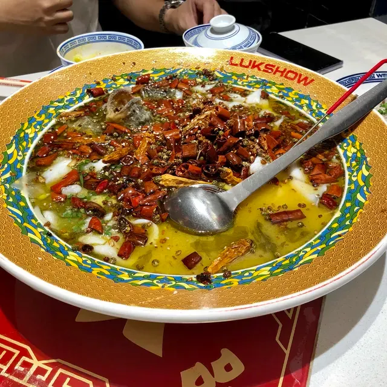

圖片來源：UncleSam頻道@TripMoment

【餐廳地址】紅寶路 KKMALL-4 層 L401 商鋪

【電話】0755-25102805

【營業時間】11:30-14:30、17:00pm-21:30

## 深圳美食｜太二酸菜魚

酸菜魚在眾多深圳美食中擁有超高人氣，除了上面提到的祿鼎記外，[太二酸菜魚](https://hk.trip.com/travel-guide/foods/shenzhen-26-restaurant/city-31492949/?locale=zh-TW&curr=TWD)也是很多人在深圳必吃的美食。太二酸菜魚號稱自己是全宇宙第二好吃的酸菜魚，每日只賣 100 條魚，即使您去排隊也不一定能吃得到。店裡的酸菜魚用鮮草魚作為食材，再配上他們自家醃製的酸菜，最後烹煮出來的酸菜魚魚肉細嫩，酸菜脆爽，魚湯酸香，令人一試難忘！

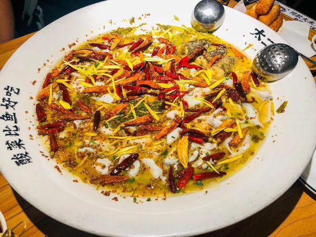

圖片來源：jj600210@Instagram

【餐廳地址】人民南路 2028 號金光華廣場 6 層

【營業時間】10:30-21:00pm

## 深圳美食｜探魚

深圳美食中，知名度最高的烤魚店非[探魚](https://hk.trip.com/travel-guide/foods/shenzhen-26-restaurant/tan-yu-fu-tian-26191487/?locale=zh-TW&curr=TWD)莫屬。探魚餐廳的裝潢、餐具器皿和菜單設計都非常具有文青風範，所以探魚被很多人讚譽為「最文青烤魚店」。店內最經典的食品是重慶豆花烤魚，使用的豆花是每日早上新鮮到店的。入口首先會感受到微微的辣和麻，接下來就能品嚐到豆子的甜味。用勺子撥開辣椒，就會看到滿滿的魚肉、豆花、豆皮、白菜等，就算是3個大胃王也完全夠吃！

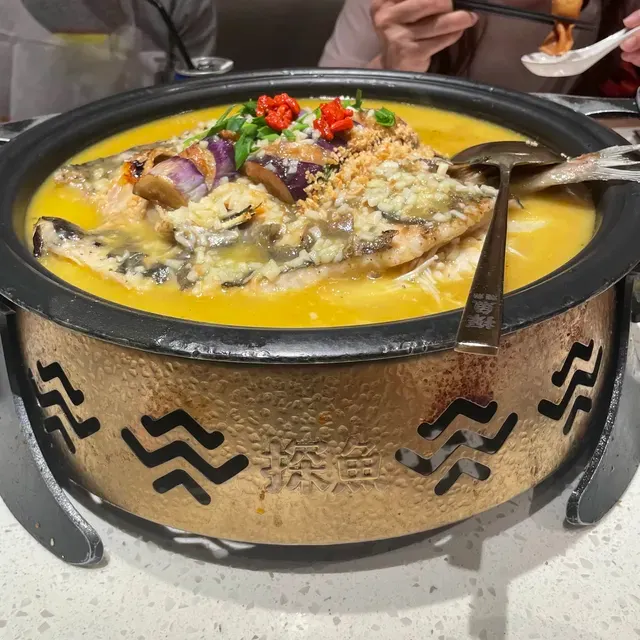

圖片來源：Toni07@TripMoment

【餐廳地址】福田區福華三路星河CoCo Park商場三層L3C-020號

【電話】0755-82551281

【營業時間】10:00-22:00

## 深圳美食｜汕頭八合裏海記牛肉店

[汕頭八合裏海記牛肉店](https://hk.trip.com/travel-guide/shenzhen-26-restaurant/shantou-bahe-lihai-ji-niuroudian-20762037/?locale=zh-TW&curr=TWD)是連謝霆鋒和蔡瀾都推介過的深圳美食！其人氣程度從排隊長度就能看得出。這間餐廳之所以受歡迎是因為店裡提供的都是新鮮手切本地牛肉，牛肉鮮而不腥，口味郁而不膩，牛肉部位多達10款，任君選擇！喜歡吃牛肉的「牛魔王」來這裡絕對能吃得心滿意足！

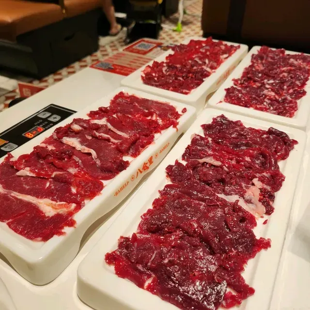

圖片來源：dond@TripMoment

【餐廳地址】福田區蔡屋圍東園路44號

【電話】0755-82229411

【營業時間】11:30-02:30

## 深圳美食｜潤園四季椰子雞

說起深圳美食中的椰子雞，[潤園四季椰子雞](https://hk.trip.com/travel-guide/shenzhen-26-restaurant/runyuan-siji-yeziji-11327383/?locale=zh-TW&curr=TWD)絕對是很多深圳人心中的第一位。這間餐廳的竹笙椰子雞是必點菜式。湯底用椰汁和椰肉打造，椰汁煮雞肉令椰子獨有的香甜滲入肉中，雞肉吃起來彈牙嫩滑，非常美味！店內的職員都有各自負責的區域，服務態度很好，顧客會享受到很滿意的用餐體驗。

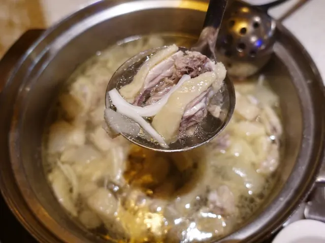

圖片來源：himiucatblog@Instagram

【餐廳地址】香山東街與汕頭街交界處華僑城東部市場4樓

【電話】0755-29128886

【營業時間】11:00-22:00

## 深圳美食｜義和雅苑

很多人喜歡吃片皮鴨，深圳美食當然也包括了它，以下為大家介紹的是位於萬象天地的義和雅苑。這是一間北京烤鴨店，店面裝修清新優雅，也很乾凈整潔，非常適合帶家人或朋友來此聚餐。強烈推薦招牌烤鴨配八寶盒！八寶盒很精緻，配有玻璃小轉盤，方便食客能蘸到醬料。烤鴨肥厚油嫩，配上黃瓜絲和蔥絲，再蘸點甜麵醬，最後卷上麵餅，吃一口就停不下來。想在深圳吃到最正宗的北京味，那就來義和雅苑。

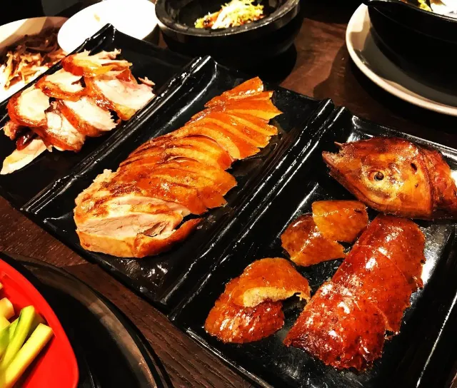

圖片來源：whitesoldierfatpig@Instagram

【餐廳地址】深南大道 9668 號華潤城萬象天地 SL257 號

【電話】0755-66640373

【營業時間】11:00-14:00、17:00-21:30

## 深圳美食｜卓記米粉

深圳美食中的平價餐廳一定少不了[卓記米粉](https://hk.trip.com/travel-guide/foods/shenzhen-26-restaurant/city-71535504/?locale=zh-TW&curr=TWD)，這是一間很多當地人都推介的新疆米粉店，店內的牛肉炒米粉人氣超高。卓記米粉可以自選辣度和份量，有人說這裡的微辣程度都會讓人吃到流眼淚，因此有不少人前來挑戰。雖然擔心辣度，但其美味又令人不自覺地垂涎，這大概就是卓記米粉的魅力吧。

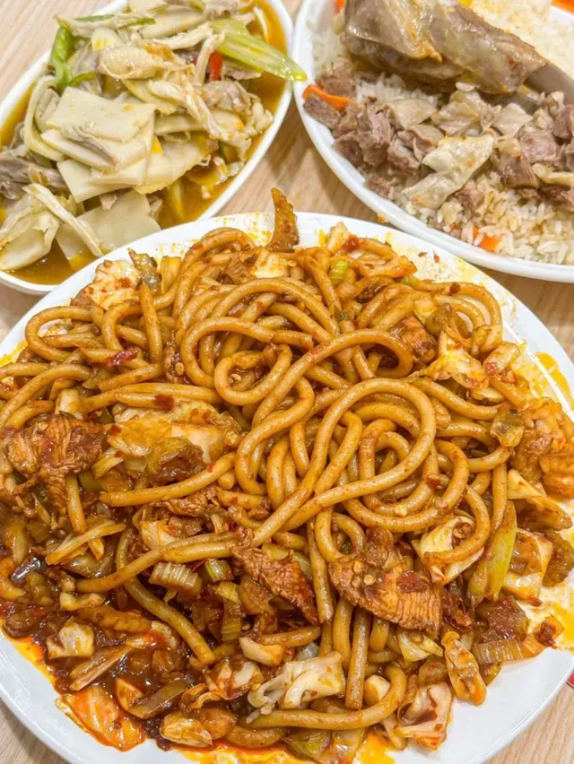

圖片來源：J\_W8789@TripMoment

【餐廳地址】羅湖區寶安南路2051號

【電話】0755-82661467

【營業時間】9:00-21:00

## 深圳美食｜海極鮮蒸汽美食坊

深圳海鮮去哪裡吃？[海極鮮蒸汽美食坊](https://hk.trip.com/travel-guide/foods/shenzhen-26-restaurant/hai-ji-xian-zheng-qi-mei-shi-fang-26339955/?locale=zh-TW&curr=TWD)是個絕佳的選擇。蒸汽海鮮能保留食材的原汁原味以及鮮嫩感。海極鮮推出海鮮大盤菜，性價比高，值得一試。食客也可以單獨點各種魚、蝦、貝類來蒸着吃，鍋底可以煮粥，蒸海鮮的鮮汁會流到鍋底的粥裡，最後吃的粥又香又柔。

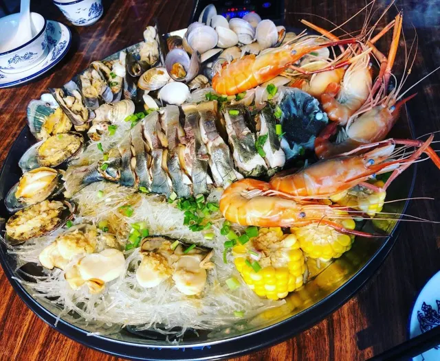

圖片來源：eddielau89@Instagram

【餐廳地址】皇崗上圍三村38號一層

【電話】0755-82720671,0755-82720672

【營業時間】11:00-02:00

## 深圳美食｜貝樂爺小海鮮火鍋·燒烤

深圳美食之旅怎能少了貝樂爺的卜卜貝火鍋！它是一間隱匿在城中村的美味火鍋店，雖然沒有奢華的店鋪裝潢，但店內的食物味道都很讚！最大特色就是卜卜貝鍋。上菜時可以看到卜卜貝都開着口，每顆裡都有肉，不缺斤少兩，洗得也很乾凈，不會吃到沙子。鍋底味道濃郁，湯汁滲着貝類本有的汁水，喝進嘴裡特別鮮甜。

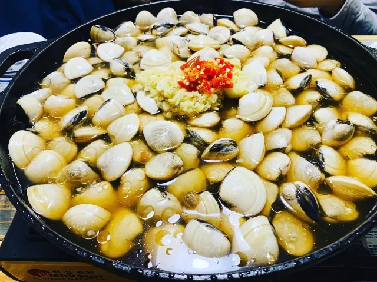

圖片來源：vinalinyh@Instagram

【餐廳地址】南山區桃源街道留仙大道平山村 295-101 號

【電話】0755-28915587

【營業時間】11:00-02:00

## 深圳美食｜仙豆糕

仙豆糕是深圳美食的一大人氣甜品，有多種口味，如紅豆、綠豆、紫薯、香芋、抹茶等。除了基本口味外，還有混搭口味。最受歡迎的是香芋芝士仙豆糕，表皮香脆，香芋與芝士的搭配融合了鹹甜兩種口味，咀嚼時還能感受到香芋的顆粒感。提提大家，任何口味的仙豆糕都要趁熱吃才最好吃。

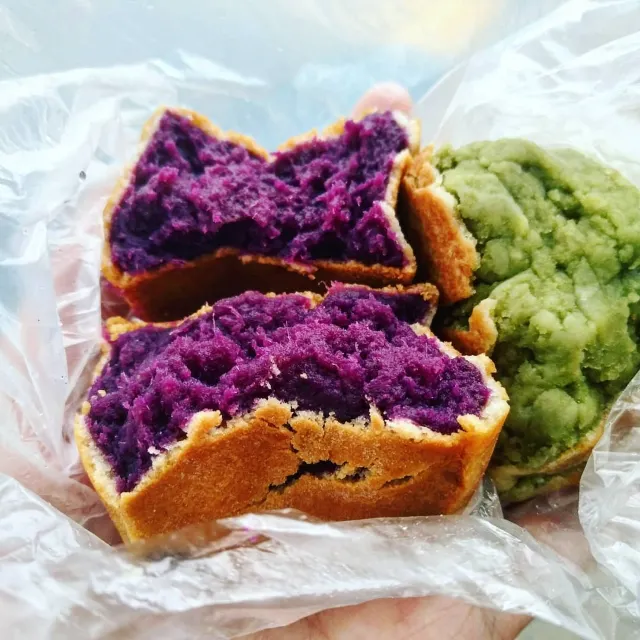

圖片來源：c\_one\_chai@Instagram

【餐廳地址】賣仙豆糕的店鋪很多，可以選多人惠顧且網上評價較好的店。

## 深圳美食｜木屋燒烤

木屋燒烤是年青人近年最喜愛的食店之一，以做第一好吃的燒烤為理念，所以對於食物要求非常高！全中國已經開設了超過 80 間分店，但每間分店都是人頭湧涌，想吃的記住提早預約排隊呀！

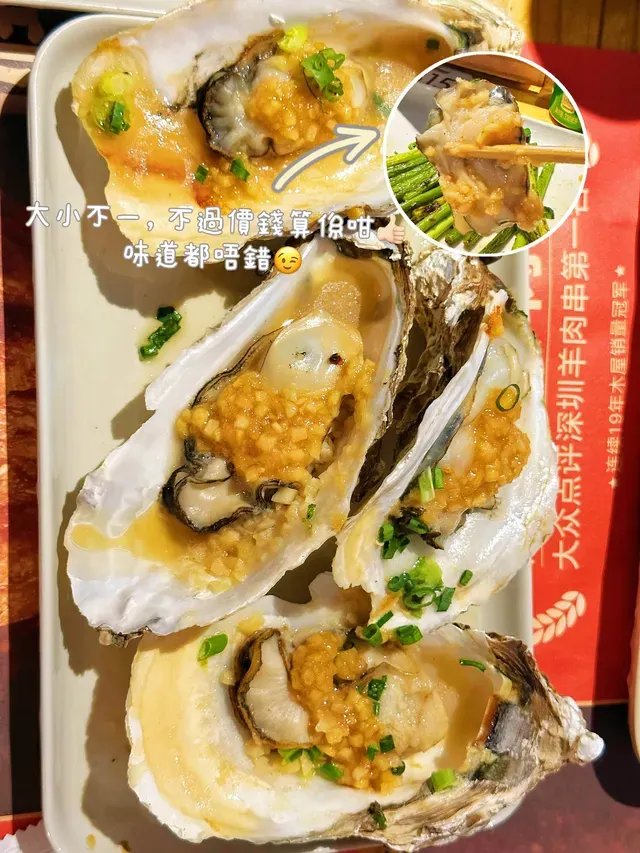

圖片來源：熱愛旅行的社畜妹妹@TripMoment

【餐廳地址】深圳市羅湖區新園路 5 號大院工人文化宮南門東升廣場 A17-1 號

【電話】0755-82795497

【營業時間】12:00 - 01:00

## 深圳美食｜洪大廚雞煲

洪大廚雞煲的名物是石橄欖雞煲，雞用上文昌雞，肉香嫩滑，滑而不肥，雞湯清香而帶新鮮雞肉的甜味，可以加上牛肉和其他火鍋配料打邊爐。除了雞煲外，這裡的其他菜色也不錯，炭烤、潮汕生腌、各種沙鍋煲仔菜及小炒都有，是宵夜的好去處。

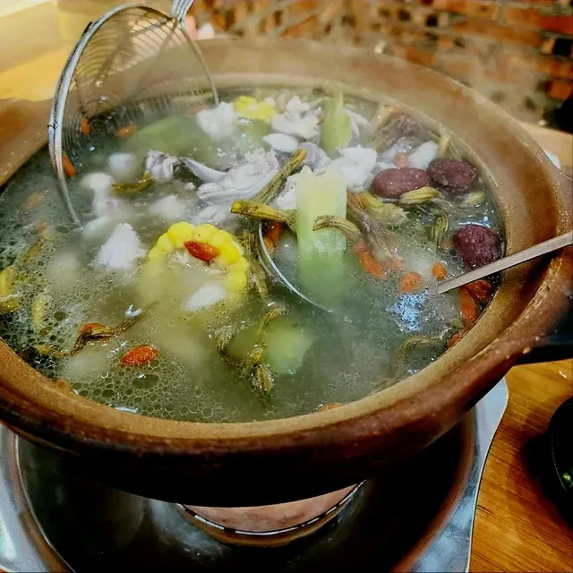

圖片來源：HenryWYM@TripMoment

【餐廳地址】深圳市南山區后海大道 2332 號

【電話】0134-10121222

【營業時間】11:30-14:30、17:30-06:30

## 深圳美食｜深圳住宿推薦

### 深圳南頭有熊酒店

深圳南頭有熊酒店由屢獲國際設計大獎的如恩設計出品，以“城中村與繁華都市共存”爲設計理念。酒店所有房間都配備寶格麗洗護用品和免費迷你吧; 8 樓是 V.O. 鄰舍有機餐廳，9 樓是擁有 200 度觀景平臺的天臺，將城市天際線映射至內部。

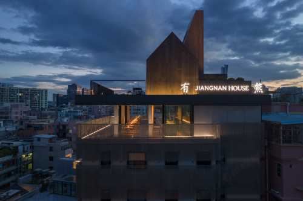

飯店

## 深圳南頭古城有熊飯店

________

4.8/5滿意565條評論

深圳, 鄰近南頭古城|中山公園地鐵站

\-28%

TWD5,798

TWD4,104

今日低價

查看詳情

### 深圳康萊德酒店

深圳康萊德飯店位於前海中心商務地段，飯店以“一個夢想家嘅故事”為靈感主題，擁有 300 間典雅人客房同套房，直面一線前海灣景、公園同都市景觀； 4 間風格各異嘅餐廳同酒吧與及超 2,100 平方嘅會議空間，為賓客打造唔同嘅商務同休閒嘅奢華體驗，展開一段大隱於市嘅現代藝術之旅。

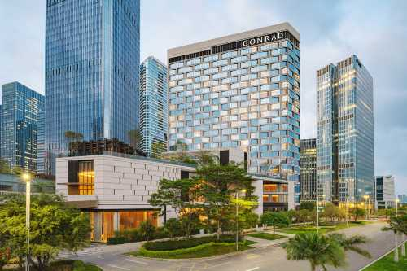

飯店

## 深圳康萊德飯店

__________

4.8/5滿意4622條評論

深圳, 前海自貿區|鄰近前海灣地鐵站

TWD10,065

今日低價

查看詳情

### 深圳益田威斯汀酒店

酒店直通世界之窗雙地鐵站，無縫連接益田假日廣場； 步行可達世界之窗和歡樂穀主題公園，毗鄰錦綉中華民俗文化村和華僑城創意文化園。 酒店配有室外花園泳池、健身房及水療中心，週六和節假日可觀賞世界之窗煙花秀。

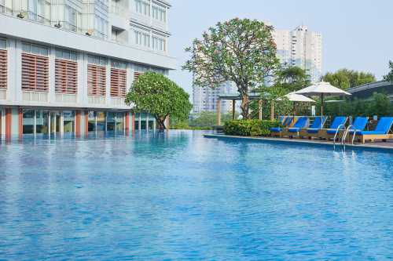

飯店

## 深圳南山益田威斯汀飯店

__________

4.6/5很好6630條評論

深圳, 鄰近深圳世界之窗|深圳萬象天地

TWD3,094

今日低價

查看詳情

### 深圳鵬瑞萊佛士酒店

飯店位於深圳南山區著名地標深圳灣1號最高塔樓，毗鄰深圳灣口岸，周邊配備多個高端購物中心和深圳灣公園，坐擁 168間 60 平方米起的奢華客房以及美食林鉑金餐廳等六個餐飲營業點，客房可俯瞰 360 度壯麗海景和城市景觀。

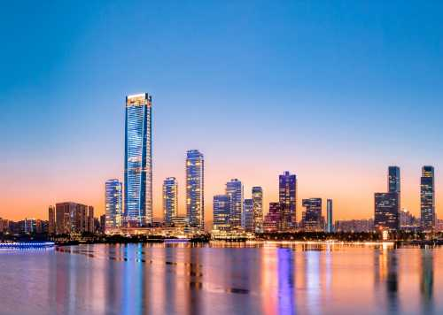

飯店

## 深圳鵬瑞萊佛士飯店

__________

4.7/5極好2295條評論

深圳, 鄰近深圳灣萬象城|春繭體育館

__2024 Asia 100 – 奢華飯店__

\-10%

TWD13,215

TWD11,699

今日低價

查看詳情

### 深圳若璽酒店（南山科技園店）

酒店於 2023 年全面裝修升級，配備奢華酒店同款床品、洗漱用品、智慧化升級，讓客戶享受國際五星客房體驗。酒店開業至今已接待劉德華，甄子丹，郭富城，張柏芝，蔡少芬等超百位港臺明星。若璽酒店邀您與眾多明星同行，一起打卡明星網紅酒店。

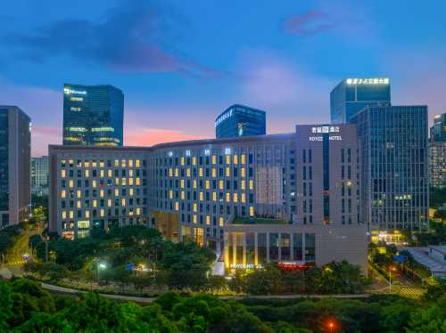

飯店

## 深圳灣若璽飯店

________

4.8/5滿意2435條評論

深圳, 鄰近深圳灣萬象城|深圳大學

\-18%

TWD2,666

TWD2,162

今日低價

查看詳情

## 深圳美食常見問題

### **第一次去深圳，必吃的深圳美食有哪些？**

第一次到深圳建議從酸菜魚、椰子雞、烤魚、卜卜貝火鍋開始，這些都是最具代表性的深圳美食。文中精選的祿鼎記、太二酸菜魚、潤園四季椰子雞都是許多人推薦的必吃餐廳。

### 深圳美食的價格大概是多少？

深圳美食選擇多元，平價米粉店每人約人民幣 30–50 元，高檔餐廳或火鍋人均消費則約 150–300 元不等，視餐廳類型而定。

### 從香港去吃深圳美食方便嗎？

非常方便！搭高鐵從香港西九龍出發到深圳福田或深圳北站，最快只要 14 分鐘，就能輕鬆展開深圳美食之旅。

### 深圳哪個地區的美食最多？

深圳的羅湖、福田和南山都是美食聚集地，羅湖有地道小吃，福田則有人氣連鎖餐廳，南山除了火鍋還有許多特色宵夜店。

免責聲明：文章來自於國際部落格平台，版權歸原作者所有，受Trip.com [條款及細則](https://tw.trip.com/contents/service-guideline/terms.html?locale=zh-tw) 和 [社群守則](https://tw.trip.com/sale/3089/communityrule.html?locale=zh-tw) 的約束。若有侵犯您的著作權，請通知我們，我們將盡快刪除相關內容。

讚

## 熱門文章

### 【溫馨親子飯店推薦】精選全台親子友善飯店，帶著家中寶貝旅遊去

TripBlog

### 【爆漿甜點】泡芙控報到囉！精選七間人氣秒殺店，通通吃起來

YonDuo旅行

### 【上海景點】2026 上海不得不去的 10 大打卡地！

Mr. Chen 旅遊達人

### 【元宵節】白白胖胖超可口，推薦11間必吃米其林推薦餐廳吃湯圓與元宵

YonDuo旅行

## 探索更多

[\# 新加坡](https://tw.trip.com/blog/tag-singapore-2464/?locale=zh-TW&curr=TWD "新加坡")

[\# 韓國](https://tw.trip.com/blog/tag-south-korea-2480/?locale=zh-TW&curr=TWD "韓國")

[\# 動物植物](https://tw.trip.com/blog/tag-flora-and-fauna-2593/?locale=zh-TW&curr=TWD "動物植物")

[\# 藝術](https://tw.trip.com/blog/tag-music-and-arts-2598/?locale=zh-TW&curr=TWD "藝術")

[\# 休閒娛樂](https://tw.trip.com/blog/tag-entertainment-2612/?locale=zh-TW&curr=TWD "休閒娛樂")

[\# 京都](https://tw.trip.com/blog/tag-kyoto-2652/?locale=zh-TW&curr=TWD "京都")

[\# 曼谷](https://tw.trip.com/blog/tag-bangkok-2671/?locale=zh-TW&curr=TWD "曼谷")

[\# 釜山](https://tw.trip.com/blog/tag-busan-3048/?locale=zh-TW&curr=TWD "釜山")

[\# 宜蘭](https://tw.trip.com/blog/tag-yilan-3697/?locale=zh-TW&curr=TWD "宜蘭")

[\# 嘉義市](https://tw.trip.com/blog/tag-chiayi-city-4996/?locale=zh-TW&curr=TWD "嘉義市")

深圳美食 Top 12

港人必讀深圳美食貼士

必裝「搵食」App：告別盲目排隊

支付與網絡：順暢結帳不尷尬

2026 必食主題清單（港人最愛）

香港旅客隱藏貼士（避坑指引）

深圳美食｜祿鼎記

深圳美食｜太二酸菜魚

深圳美食｜探魚

深圳美食｜汕頭八合裏海記牛肉店

深圳美食｜潤園四季椰子雞

深圳美食｜義和雅苑

深圳美食｜卓記米粉

深圳美食｜海極鮮蒸汽美食坊

深圳美食｜貝樂爺小海鮮火鍋·燒烤

深圳美食｜仙豆糕

深圳美食｜木屋燒烤

深圳美食｜洪大廚雞煲

深圳美食｜深圳住宿推薦

深圳南頭有熊酒店

深圳康萊德酒店

深圳益田威斯汀酒店

深圳鵬瑞萊佛士酒店

深圳若璽酒店（南山科技園店）

深圳美食常見問題

第一次去深圳，必吃的深圳美食有哪些？

深圳美食的價格大概是多少？

從香港去吃深圳美食方便嗎？

深圳哪個地區的美食最多？

### 人氣旅遊部落格

[【2026 Trip.com優惠碼】5月最新官方 Trip.com 折扣碼，機票、飯店、信用卡、旅展優惠（即時更新）](https://tw.trip.com/blog/tw-promo-code?locale=zh-TW&curr=TWD "【2026 Trip.com優惠碼】5月最新官方 Trip.com 折扣碼，機票、飯店、信用卡、旅展優惠（即時更新）")  |  [【Post Malone演唱會2026】台灣場4/9、10開售！票價、搶票平臺&時間&攻略、嘉賓搶先看](https://tw.trip.com/blog/post-malone-concert-tw?locale=zh-TW&curr=TWD "【Post Malone演唱會2026】台灣場4/9、10開售！票價、搶票平臺&時間&攻略、嘉賓搶先看")  |  [【端午節肉粽推薦2026】全台15家好吃肉粽名店推薦，北部粽、南部粽、台北肉粽一次看](https://tw.trip.com/blog/meat-zongzi-tw?locale=zh-TW&curr=TWD "【端午節肉粽推薦2026】全台15家好吃肉粽名店推薦，北部粽、南部粽、台北肉粽一次看")  |  [【IVE演唱會2026】4/8 11:00拓元售票！小巨蛋9/13加場！搶票、座位圖、VIP福利全攻略](https://tw.trip.com/blog/ive-concert-tw?locale=zh-TW&curr=TWD "【IVE演唱會2026】4/8 11:00拓元售票！小巨蛋9/13加場！搶票、座位圖、VIP福利全攻略")  |  [【NMIXX高雄演唱會2026】5/13中午11點起理想國會員預售！5/14中午11點拓元開售！7/11登入高雄巨蛋！票價、搶票攻略、座位表、VIP福利全指南](https://tw.trip.com/blog/nmixx-concert-tw?locale=zh-TW&curr=TWD "【NMIXX高雄演唱會2026】5/13中午11點起理想國會員預售！5/14中午11點拓元開售！7/11登入高雄巨蛋！票價、搶票攻略、座位表、VIP福利全指南")  |  [【EXO演唱會2026】高雄巨蛋加場！5/13中午12點拓元售票開賣！7/18、7/19高雄巨蛋開唱！搶票、票價、座位圖全攻略](https://tw.trip.com/blog/exo-concert-tw?locale=zh-TW&curr=TWD "【EXO演唱會2026】高雄巨蛋加場！5/13中午12點拓元售票開賣！7/18、7/19高雄巨蛋開唱！搶票、票價、座位圖全攻略")  |  [【邁阿密大師賽2026】辛納、莎芭蓮卡衝雙冠，希克爆冷出局！邁阿密網球大師賽賽程、比分、直播平臺全攻略](https://tw.trip.com/blog/miami-open?locale=zh-TW&curr=TWD "【邁阿密大師賽2026】辛納、莎芭蓮卡衝雙冠，希克爆冷出局！邁阿密網球大師賽賽程、比分、直播平臺全攻略")  |  [【ITZY 演唱會2026】高雄場加場今12點開售！6/27、28高雄巨蛋開唱！票價、搶票、座位圖、福利一次看](https://tw.trip.com/blog/itzy-concert-tw?locale=zh-TW&curr=TWD "【ITZY 演唱會2026】高雄場加場今12點開售！6/27、28高雄巨蛋開唱！票價、搶票、座位圖、福利一次看")  |  [【2026端午連假】端午節連假怎麼放？端午活動、請假攻略與國內外好去處一次看](https://tw.trip.com/blog/dragonboat-festival-holiday?locale=zh-TW&curr=TWD "【2026端午連假】端午節連假怎麼放？端午活動、請假攻略與國內外好去處一次看")  |  [【2026午時水】午時水可以放多久？功效、製作方法、禁忌與使用方式一次看](https://tw.trip.com/blog/noon-water2025?locale=zh-TW&curr=TWD "【2026午時水】午時水可以放多久？功效、製作方法、禁忌與使用方式一次看")  |  [【台北大巨蛋】2026大巨蛋演唱會&中職賽事一覽！台北大巨蛋座位圖&中職賽程&交通&美食懶人包](https://tw.trip.com/blog/taipei-dome?locale=zh-TW&curr=TWD "【台北大巨蛋】2026大巨蛋演唱會&中職賽事一覽！台北大巨蛋座位圖&中職賽程&交通&美食懶人包")  |  [【2026 桃園室內景點推薦】下雨天去哪好玩？30個親子/情侶約會好去處](https://tw.trip.com/blog/taoyuan-indoor-attractions?locale=zh-TW&curr=TWD "【2026 桃園室內景點推薦】下雨天去哪好玩？30個親子/情侶約會好去處")  |  [【2026釜山膠囊列車預約】天空膠囊搭乘攻略！票價/路線/拍照懶人包](https://tw.trip.com/blog/busan-sky-capsule?locale=zh-TW&curr=TWD "【2026釜山膠囊列車預約】天空膠囊搭乘攻略！票價/路線/拍照懶人包")  |   [【MLB2026】賽程時間、往屆回顧、焦點球隊球員、必看比賽、轉播平台與場館懶人包](https://tw.trip.com/blog/major-league-baseball?locale=zh-TW&curr=TWD " 【MLB2026】賽程時間、往屆回顧、焦點球隊球員、必看比賽、轉播平台與場館懶人包")  |  [【冠軍之路特展2025】世界12強棒球賽台國立台灣博物館全展出，與球迷共同分享冠軍光輝歷程](https://tw.trip.com/blog/special-exhibition-of-top-12-champions?locale=zh-TW&curr=TWD "【冠軍之路特展2025】世界12強棒球賽台國立台灣博物館全展出，與球迷共同分享冠軍光輝歷程 ")   |  [【F1日本大獎賽2026】F1賽程、排位賽&轉播時間、門票、車手、綫上看觀賽全指南](https://tw.trip.com/blog/formula1-japan-grand-prix?locale=zh-TW&curr=TWD "【F1日本大獎賽2026】F1賽程、排位賽&轉播時間、門票、車手、綫上看觀賽全指南")  |  [【大甲媽祖遶境2026】9天8夜全攻略，時間、行程、路線、直播、交通、裝備、禁忌一次看](https://tw.trip.com/blog/dajia-mazu?locale=zh-TW&curr=TWD "【大甲媽祖遶境2026】9天8夜全攻略，時間、行程、路線、直播、交通、裝備、禁忌一次看")  |  [【富士山2025花火大會】The 絶景花火 Mt.Fuji 2025，門票、亮點、交通攻略](https://tw.trip.com/blog/2025-fuji-fireworks-festival?locale=zh-TW&curr=TWD "【富士山2025花火大會】The 絶景花火 Mt.Fuji 2025，門票、亮點、交通攻略")  |  [【釜山櫻花2026】釜山賞櫻去哪裡？最佳賞櫻時期、釜山10大賞櫻景點、交通、住宿全攻略！](https://tw.trip.com/blog/busan-cherry?locale=zh-TW&curr=TWD "【釜山櫻花2026】釜山賞櫻去哪裡？最佳賞櫻時期、釜山10大賞櫻景點、交通、住宿全攻略！")  |  [【2026 日本跨年攻略】日本跨年怎麼玩？東京/大阪/京都/沖繩新年景點、跨年習俗、注意事項總整理](https://tw.trip.com/blog/%E6%97%A5%E6%9C%AC%E8%B7%A8%E5%B9%B4?locale=zh-TW&curr=TWD "【2026 日本跨年攻略】日本跨年怎麼玩？東京/大阪/京都/沖繩新年景點、跨年習俗、注意事項總整理")  |  [【2026 首爾跨年攻略】首爾跨年怎麼玩？首爾跨年推薦活動、元旦活動、注意事項總整理](https://tw.trip.com/blog/%E9%A6%96%E7%88%BE%E8%B7%A8%E5%B9%B4?locale=zh-TW&curr=TWD "【2026 首爾跨年攻略】首爾跨年怎麼玩？首爾跨年推薦活動、元旦活動、注意事項總整理")  |  [【追淚趁現在】馬祖藍眼淚強勢來襲，罕見藍光一生一定要體驗一次！](https://tw.trip.com/blog/2021matsu-bluetears?locale=zh-TW&curr=TWD "【追淚趁現在】馬祖藍眼淚強勢來襲，罕見藍光一生一定要體驗一次！")  |  [【台中爬山新手懶人包】8條台中登山步道推薦！秘境、夜景一次看](https://tw.trip.com/blog/taichung-mountain-climbing?locale=zh-TW&curr=TWD "【台中爬山新手懶人包】8條台中登山步道推薦！秘境、夜景一次看")  |  [【富士山初冠雪2024】10月23日富士山迎來初冠雪！必看2024富士山年初冠雪觀賞&溫泉&住宿&交通全攻略](https://tw.trip.com/blog/mt-fuji-first-crown-snow?locale=zh-TW&curr=TWD "【富士山初冠雪2024】10月23日富士山迎來初冠雪！必看2024富士山年初冠雪觀賞&溫泉&住宿&交通全攻略")  |  [【太麻里金針花2025】台東太麻里金針花季景點全攻略！花期&景點&交通&飯店懶人包！](https://tw.trip.com/blog/daylily2025?locale=zh-TW&curr=TWD "【太麻里金針花2025】台東太麻里金針花季景點全攻略！花期&景點&交通&飯店懶人包！")  |  [【2026 日本福袋】跨年日本自由行必看！精選 10 款日本福袋名單，三麗鷗、拉拉熊聯名福袋一次收藏](https://tw.trip.com/blog/%E6%97%A5%E6%9C%AC%E7%A6%8F%E8%A2%8B?locale=zh-TW&curr=TWD "【2026 日本福袋】跨年日本自由行必看！精選 10 款日本福袋名單，三麗鷗、拉拉熊聯名福袋一次收藏")  |  [【夜訪螢火蟲】2026日月潭星光螢火季！騎鐵馬旅遊、六大賞螢據點報你知](https://tw.trip.com/blog/2021-sunmoonlake-firefly?locale=zh-TW&curr=TWD "【夜訪螢火蟲】2026日月潭星光螢火季！騎鐵馬旅遊、六大賞螢據點報你知")  |  [【2026日本紫藤花季】夢幻紫色花海！8大必訪日本賞花景點、開花時間、交通路線全攻略](https://tw.trip.com/blog/japan-wisteria-season?locale=zh-TW&curr=TWD "【2026日本紫藤花季】夢幻紫色花海！8大必訪日本賞花景點、開花時間、交通路線全攻略")  |  [【濟州島櫻花2026】濟州島9大賞櫻景點懶人包， 韓國最早的賞櫻景點！](https://tw.trip.com/blog/jeju-cherry?locale=zh-TW&curr=TWD "【濟州島櫻花2026】濟州島9大賞櫻景點懶人包， 韓國最早的賞櫻景點！")  |  [【京都楓葉 2025】日本京都賞楓景點必收！楓葉時間、熱門賞楓地圖、交通住宿懶人包](https://tw.trip.com/blog/kyoto-mapleleaves?locale=zh-TW&curr=TWD "【京都楓葉 2025】日本京都賞楓景點必收！楓葉時間、熱門賞楓地圖、交通住宿懶人包")

### 熱門景點

[中華人民共和國名譽主席宋慶齡陵園](https://tw.trip.com/travel-guide/attraction/shanghai/soong-ching-ling-memorial-park-75623?poiType=3&locale=zh-TW&curr=TWD "中華人民共和國名譽主席宋慶齡陵園")  |  [梅里古鎮-泰伯廟](https://tw.trip.com/travel-guide/attraction/wuxi/meicun-taibo-temple-75724?poiType=3&locale=zh-TW&curr=TWD "梅里古鎮-泰伯廟")  |  [黿頭渚](https://tw.trip.com/travel-guide/attraction/wuxi/tai-hu-yuantouzhu-scenic-spot-75725?poiType=3&locale=zh-TW&curr=TWD "黿頭渚")  |  [桂林公園](https://tw.trip.com/travel-guide/attraction/shanghai/guilin-park-75626?poiType=3&locale=zh-TW&curr=TWD "桂林公園")  |  [東方明珠](https://tw.trip.com/travel-guide/attraction/shanghai/oriental-pearl-radio-and-television-tower-75627?poiType=3&locale=zh-TW&curr=TWD "東方明珠")  |  [棒棰島](https://tw.trip.com/travel-guide/attraction/dalian/bangchui-island-75628?poiType=3&locale=zh-TW&curr=TWD "棒棰島")  |  [北大橋](https://tw.trip.com/travel-guide/attraction/dalian/north-bridge-75629?poiType=3&locale=zh-TW&curr=TWD "北大橋")  |  [怡園](https://tw.trip.com/travel-guide/attraction/suzhou/yiyuan-garden-75730?poiType=3&locale=zh-TW&curr=TWD "怡園")  |  [冰峪溝](https://tw.trip.com/travel-guide/attraction/zhuanghe/bingyu-valley-75631?poiType=3&locale=zh-TW&curr=TWD "冰峪溝")  |  [海王九島](https://tw.trip.com/travel-guide/attraction/zhuanghe/dalian-haiwang-nine-islands-tourist-area-75632?poiType=3&locale=zh-TW&curr=TWD "海王九島")  |  [大連森林動物園](https://tw.trip.com/travel-guide/attraction/dalian/dalian-forest-zoo-75633?poiType=3&locale=zh-TW&curr=TWD "大連森林動物園")  |  [大明寺](https://tw.trip.com/travel-guide/attraction/yangzhou/daming-temple-75734?poiType=3&locale=zh-TW&curr=TWD "大明寺")  |  [個園](https://tw.trip.com/travel-guide/attraction/yangzhou/geyuan-garden-75735?poiType=3&locale=zh-TW&curr=TWD "個園")  |  [何園](https://tw.trip.com/travel-guide/attraction/yangzhou/he-garden-75736?poiType=3&locale=zh-TW&curr=TWD "何園")  |  [揚州石塔](https://tw.trip.com/travel-guide/attraction/yangzhou/gumulan-yard-shita-75737?poiType=3&locale=zh-TW&curr=TWD "揚州石塔")  |  [始信峰](https://tw.trip.com/travel-guide/attraction/huangshan-city/shixin-peak-75820?poiType=3&locale=zh-TW&curr=TWD "始信峰")  |  [白沙壁畫](https://tw.trip.com/travel-guide/attraction/yulong/baisha-murals-75921?poiType=3&locale=zh-TW&curr=TWD "白沙壁畫")  |  [玉峰寺](https://tw.trip.com/travel-guide/attraction/yulong/yufeng-temple-75922?poiType=3&locale=zh-TW&curr=TWD "玉峰寺")  |  [長江第一灣](https://tw.trip.com/travel-guide/attraction/shangri-la/first-bay-of-the-yangtze-river-75923?poiType=3&locale=zh-TW&curr=TWD "長江第一灣")  |  [香港歷史博物館](https://tw.trip.com/travel-guide/attraction/hong-kong/hong-kong-museum-of-history-76024?poiType=3&locale=zh-TW&curr=TWD "香港歷史博物館")  |  [Parc et Monument Guillaume-Couture](https://tw.trip.com/travel-guide/attraction/levis/monument-guillaume-couture-50605228?poiType=3&locale=zh-TW&curr=TWD "Parc et Monument Guillaume-Couture")  |  [金檀村](https://tw.trip.com/travel-guide/attraction/shaoyang-county/jintan-village-83763130?poiType=3&locale=zh-TW&curr=TWD "金檀村")

### 熱門排行榜

[佛山 50 大必嚐美食](https://tw.trip.com/toplist/tripbest/foshan-best-must-visit-restaurants-100900014113/?districtId=207&locale=zh-TW&curr=TWD "佛山 50 大必嚐美食")  |  [胡志明市 50 大必嚐美食](https://tw.trip.com/toplist/tripbest/ho-chi-minh-city-best-must-visit-restaurants-100900013770/?districtId=434&locale=zh-TW&curr=TWD "胡志明市 50 大必嚐美食")  |  [濟州市 50 大必嚐美食](https://tw.trip.com/toplist/tripbest/jeju-city-best-must-visit-restaurants-100900013952/?districtId=1446512&locale=zh-TW&curr=TWD "濟州市 50 大必嚐美食")  |  [西歸浦市 50 大人氣景點](https://tw.trip.com/toplist/tripbest/seogwipo-best-things-to-do-100000000409/?districtId=14755&locale=zh-TW&curr=TWD "西歸浦市 50 大人氣景點")  |  [諾夫哥羅德州的熱門豪華飯店](https://tw.trip.com/toplist/tripbest/novgorod-oblast-best-premium-hotels-100200528482/?districtId=1445936&locale=zh-TW&curr=TWD "諾夫哥羅德州的熱門豪華飯店")  |  [突厥斯坦的熱門豪華飯店](https://tw.trip.com/toplist/tripbest/turkistan-best-premium-hotels-100200259489/?districtId=21382&locale=zh-TW&curr=TWD "突厥斯坦的熱門豪華飯店")  |  [舊金山 50 大必嚐美食](https://tw.trip.com/toplist/tripbest/san-francisco-best-must-visit-restaurants-100900014050/?districtId=249&locale=zh-TW&curr=TWD "舊金山 50 大必嚐美食")  |  [芽莊 20 大人氣景點](https://tw.trip.com/toplist/tripbest/nha-trang-best-things-to-do-100000000913/?districtId=670&locale=zh-TW&curr=TWD "芽莊 20 大人氣景點")  |  [杜蘭戈州的熱門豪華飯店](https://tw.trip.com/toplist/tripbest/durango-best-premium-hotels-100200259977/?districtId=32007&locale=zh-TW&curr=TWD "杜蘭戈州的熱門豪華飯店")  |  [雪梨 50 大必嚐美食](https://tw.trip.com/toplist/tripbest/sydney-best-must-visit-restaurants-100900013924/?districtId=236&locale=zh-TW&curr=TWD "雪梨 50 大必嚐美食")  |  [大新的熱門人氣景點](https://tw.trip.com/toplist/tripbest/daxin-best-things-to-do-10079639111111/?districtId=963&locale=zh-TW&curr=TWD "大新的熱門人氣景點")  |  [威尼斯 20 大人氣景點](https://tw.trip.com/toplist/tripbest/venice-best-things-to-do-100000001341/?districtId=340&locale=zh-TW&curr=TWD "威尼斯 20 大人氣景點")  |  [撣邦的熱門豪華飯店](https://tw.trip.com/toplist/tripbest/shan-best-premium-hotels-100200218296/?districtId=24611&locale=zh-TW&curr=TWD "撣邦的熱門豪華飯店")  |  [大諾夫哥羅德的熱門豪華飯店](https://tw.trip.com/toplist/tripbest/veliky-novgorod-best-premium-hotels-100200528483/?districtId=4715&locale=zh-TW&curr=TWD "大諾夫哥羅德的熱門豪華飯店")  |  [台北 50 大必嚐美食](https://tw.trip.com/toplist/tripbest/taipei-best-must-visit-restaurants-100900013798/?districtId=360&locale=zh-TW&curr=TWD "台北 50 大必嚐美食")  |  [鄰近奇姆肯特的熱門豪華飯店](https://tw.trip.com/toplist/tripbest/shymkent-best-premium-hotels-100200261908/?districtId=21385&locale=zh-TW&curr=TWD "鄰近奇姆肯特的熱門豪華飯店")  |  [鄰近巴洛文托的熱門奢華飯店](https://tw.trip.com/toplist/tripbest/barlovento-best-luxury-hotels-100200489015/?districtId=135188&locale=zh-TW&curr=TWD "鄰近巴洛文托的熱門奢華飯店")  |  [南京 50 大必嚐美食](https://tw.trip.com/toplist/tripbest/nanjing-best-must-visit-restaurants-100900014085/?districtId=9&locale=zh-TW&curr=TWD "南京 50 大必嚐美食")  |  [東枝的熱門豪華飯店](https://tw.trip.com/toplist/tripbest/taunggyi-best-premium-hotels-100200216236/?districtId=1447476&locale=zh-TW&curr=TWD "東枝的熱門豪華飯店")  |  [三亞 50 大必嚐美食](https://tw.trip.com/toplist/tripbest/sanya-best-must-visit-restaurants-100900014078/?districtId=61&locale=zh-TW&curr=TWD "三亞 50 大必嚐美食")  |  [札幌 50 大必嚐美食](https://tw.trip.com/toplist/tripbest/sapporo-best-must-visit-restaurants-100900013966/?districtId=1878&locale=zh-TW&curr=TWD "札幌 50 大必嚐美食")  |  [溫哥華 50 大必嚐美食](https://tw.trip.com/toplist/tripbest/vancouver-best-must-visit-restaurants-100900014099/?districtId=354&locale=zh-TW&curr=TWD "溫哥華 50 大必嚐美食")  |  [樂業的熱門人氣景點](https://tw.trip.com/toplist/tripbest/leye-best-things-to-do-10079689111111/?districtId=968&locale=zh-TW&curr=TWD "樂業的熱門人氣景點")  |  [杜蘭戈的熱門豪華飯店](https://tw.trip.com/toplist/tripbest/durango-best-premium-hotels-100200258229/?districtId=17779&locale=zh-TW&curr=TWD "杜蘭戈的熱門豪華飯店")  |  [託木斯克州的熱門豪華飯店](https://tw.trip.com/toplist/tripbest/tomsk-oblast-best-premium-hotels-100200510715/?districtId=1524581&locale=zh-TW&curr=TWD "託木斯克州的熱門豪華飯店")  |  [仙本那 10 大人氣景點](https://tw.trip.com/toplist/tripbest/semporna-best-things-to-do-100000000751/?districtId=14898&locale=zh-TW&curr=TWD "仙本那 10 大人氣景點")  |  [拉馬蒂埃勒的熱門奢華飯店](https://tw.trip.com/toplist/tripbest/ramatuelle-best-luxury-hotels-100200252820/?districtId=51889&locale=zh-TW&curr=TWD "拉馬蒂埃勒的熱門奢華飯店")  |  [雷克雅未克 20 大人氣景點](https://tw.trip.com/toplist/tripbest/reykjavik-best-things-to-do-100000000270/?districtId=1044&locale=zh-TW&curr=TWD "雷克雅未克 20 大人氣景點")  |  [倫敦 50 大必嚐美食](https://tw.trip.com/toplist/tripbest/london-best-must-visit-restaurants-100900013805/?districtId=309&locale=zh-TW&curr=TWD "倫敦 50 大必嚐美食")  |  [東京 50 大人氣景點](https://tw.trip.com/toplist/tripbest/tokyo-best-things-to-do-100000001060/?districtId=294&locale=zh-TW&curr=TWD "東京 50 大人氣景點")

### 熱門目的地

[龍門旅遊](https://tw.trip.com/travel-guide/destination/longmen-2949?locale=zh-TW&curr=TWD "龍門旅遊")  |  [布斯克呂郡旅遊](https://tw.trip.com/travel-guide/destination/buskerud-28050?locale=zh-TW&curr=TWD "布斯克呂郡旅遊")  |  [博霍爾特旅遊](https://tw.trip.com/travel-guide/destination/bocholt-26251?locale=zh-TW&curr=TWD "博霍爾特旅遊")  |  [長灘旅遊](https://tw.trip.com/travel-guide/destination/long-beach-1445252?locale=zh-TW&curr=TWD "長灘旅遊")  |  [約翰斯布魯旅遊](https://tw.trip.com/travel-guide/destination/jonesborough-38053?locale=zh-TW&curr=TWD "約翰斯布魯旅遊")  |  [奧科伊旅遊](https://tw.trip.com/travel-guide/destination/ocoee-38254?locale=zh-TW&curr=TWD "奧科伊旅遊")  |  [阿普蘭旅遊](https://tw.trip.com/travel-guide/destination/upland-34955?locale=zh-TW&curr=TWD "阿普蘭旅遊")  |  [蓬圖瓦茲旅遊](https://tw.trip.com/travel-guide/destination/pontoise-11356?locale=zh-TW&curr=TWD "蓬圖瓦茲旅遊")  |  [亞斯旅遊](https://tw.trip.com/travel-guide/destination/yass-16259?locale=zh-TW&curr=TWD "亞斯旅遊")  |  [利特爾福爾斯旅遊](https://tw.trip.com/travel-guide/destination/little-falls-1685660?locale=zh-TW&curr=TWD "利特爾福爾斯旅遊")  |  [塔布旅遊](https://tw.trip.com/travel-guide/destination/tarbes-13461?locale=zh-TW&curr=TWD "塔布旅遊")  |  [埃納旅遊](https://tw.trip.com/travel-guide/destination/aisne-1447762?locale=zh-TW&curr=TWD "埃納旅遊")  |  [旺多姆旅遊](https://tw.trip.com/travel-guide/destination/vendome-51563?locale=zh-TW&curr=TWD "旺多姆旅遊")  |  [佩塔盧馬旅遊](https://tw.trip.com/travel-guide/destination/petaluma-18332?locale=zh-TW&curr=TWD "佩塔盧馬旅遊")  |  [梅基施-奧得蘭縣旅遊](https://tw.trip.com/travel-guide/destination/markisch-oderland-1612433?locale=zh-TW&curr=TWD "梅基施-奧得蘭縣旅遊")  |  [尼古拉斯維爾旅遊](https://tw.trip.com/travel-guide/destination/nicholasville-32434?locale=zh-TW&curr=TWD "尼古拉斯維爾旅遊")  |  [蓋爾南韋爾旅遊](https://tw.trip.com/travel-guide/destination/guerneville-18335?locale=zh-TW&curr=TWD "蓋爾南韋爾旅遊")  |  [雷德布里奇旅遊](https://tw.trip.com/travel-guide/destination/redbridge-1447636?locale=zh-TW&curr=TWD "雷德布里奇旅遊")  |  [默裡旅遊](https://tw.trip.com/travel-guide/destination/murray-32414?locale=zh-TW&curr=TWD "默裡旅遊")  |  [肥東旅遊](https://tw.trip.com/travel-guide/destination/feidong-2615?locale=zh-TW&curr=TWD "肥東旅遊")  |  [亞穆蘇克羅旅遊](https://tw.trip.com/travel-guide/destination/yamoussoukro-10516?locale=zh-TW&curr=TWD "亞穆蘇克羅旅遊")  |  [聖約翰旅遊](https://tw.trip.com/travel-guide/destination/saint-john-41817?locale=zh-TW&curr=TWD "聖約翰旅遊")  |  [帕特南縣旅遊](https://tw.trip.com/travel-guide/destination/putnam-county-1444518?locale=zh-TW&curr=TWD "帕特南縣旅遊")  |  [嘉善旅遊](https://tw.trip.com/travel-guide/destination/jiashan-1019?locale=zh-TW&curr=TWD "嘉善旅遊")  |  [默里港旅遊](https://tw.trip.com/travel-guide/destination/port-murray-41420?locale=zh-TW&curr=TWD "默里港旅遊")  |  [韋姆德旅遊](https://tw.trip.com/travel-guide/destination/varmdo-22521?locale=zh-TW&curr=TWD "韋姆德旅遊")  |  [加登城旅遊](https://tw.trip.com/travel-guide/destination/garden-city-39922?locale=zh-TW&curr=TWD "加登城旅遊")  |  [內江旅遊](https://tw.trip.com/travel-guide/destination/neijiang-823?locale=zh-TW&curr=TWD "內江旅遊")

### 熱門目的地推薦景點

[台北熱門景點](https://tw.trip.com/travel-guide/attraction/taipei-360/tourist-attractions/?locale=zh-TW&curr=TWD "台北熱門景點")  |  [東京熱門景點](https://tw.trip.com/travel-guide/attraction/tokyo-294/tourist-attractions/?locale=zh-TW&curr=TWD "東京熱門景點")  |  [大阪熱門景點](https://tw.trip.com/travel-guide/attraction/osaka-293/tourist-attractions/?locale=zh-TW&curr=TWD "大阪熱門景點")  |  [高雄熱門景點](https://tw.trip.com/travel-guide/attraction/kaohsiung-756/tourist-attractions/?locale=zh-TW&curr=TWD "高雄熱門景點")  |  [首爾熱門景點](https://tw.trip.com/travel-guide/attraction/seoul-234/tourist-attractions/?locale=zh-TW&curr=TWD "首爾熱門景點")  |  [香港熱門景點](https://tw.trip.com/travel-guide/attraction/hong-kong-38/tourist-attractions/?locale=zh-TW&curr=TWD "香港熱門景點")  |  [曼谷熱門景點](https://tw.trip.com/travel-guide/attraction/bangkok-191/tourist-attractions/?locale=zh-TW&curr=TWD "曼谷熱門景點")  |  [沖繩市熱門景點](https://tw.trip.com/travel-guide/attraction/okinawa-city-1446652/tourist-attractions/?locale=zh-TW&curr=TWD "沖繩市熱門景點")  |  [台中熱門景點](https://tw.trip.com/travel-guide/attraction/taichung-1369/tourist-attractions/?locale=zh-TW&curr=TWD "台中熱門景點")  |  [花蓮熱門景點](https://tw.trip.com/travel-guide/attraction/hualien-1366/tourist-attractions/?locale=zh-TW&curr=TWD "花蓮熱門景點")  |  [釜山熱門景點](https://tw.trip.com/travel-guide/attraction/busan-432/tourist-attractions/?locale=zh-TW&curr=TWD "釜山熱門景點")  |  [上海熱門景點](https://tw.trip.com/travel-guide/attraction/shanghai-2/tourist-attractions/?locale=zh-TW&curr=TWD "上海熱門景點")  |  [澳門熱門景點](https://tw.trip.com/travel-guide/attraction/macau-39/tourist-attractions/?locale=zh-TW&curr=TWD "澳門熱門景點")  |  [台南熱門景點](https://tw.trip.com/travel-guide/attraction/tainan-757/tourist-attractions/?locale=zh-TW&curr=TWD "台南熱門景點")  |  [札幌熱門景點](https://tw.trip.com/travel-guide/attraction/sapporo-1878/tourist-attractions/?locale=zh-TW&curr=TWD "札幌熱門景點")  |  [宜蘭熱門景點](https://tw.trip.com/travel-guide/attraction/yilan-1383/tourist-attractions/?locale=zh-TW&curr=TWD "宜蘭熱門景點")  |  [胡志明市熱門景點](https://tw.trip.com/travel-guide/attraction/ho-chi-minh-city-434/tourist-attractions/?locale=zh-TW&curr=TWD "胡志明市熱門景點")  |  [吉隆坡熱門景點](https://tw.trip.com/travel-guide/attraction/kuala-lumpur-45/tourist-attractions/?locale=zh-TW&curr=TWD "吉隆坡熱門景點")  |  [福岡熱門景點](https://tw.trip.com/travel-guide/attraction/fukuoka-576/tourist-attractions/?locale=zh-TW&curr=TWD "福岡熱門景點")  |  [屏東熱門景點](https://tw.trip.com/travel-guide/attraction/pingtung-1364/tourist-attractions/?locale=zh-TW&curr=TWD "屏東熱門景點")  |  [桃園熱門景點](https://tw.trip.com/travel-guide/attraction/taoyuan-1439/tourist-attractions/?locale=zh-TW&curr=TWD "桃園熱門景點")  |  [新北熱門景點](https://tw.trip.com/travel-guide/attraction/new-taipei-city-2063/tourist-attractions/?locale=zh-TW&curr=TWD "新北熱門景點")  |  [名古屋熱門景點](https://tw.trip.com/travel-guide/attraction/nagoya-2127/tourist-attractions/?locale=zh-TW&curr=TWD "名古屋熱門景點")  |  [新加坡熱門景點](https://tw.trip.com/travel-guide/attraction/singapore-53/tourist-attractions/?locale=zh-TW&curr=TWD "新加坡熱門景點")  |  [那霸熱門景點](https://tw.trip.com/travel-guide/attraction/naha-57429/tourist-attractions/?locale=zh-TW&curr=TWD "那霸熱門景點")  |  [清邁熱門景點](https://tw.trip.com/travel-guide/attraction/chiang-mai-209/tourist-attractions/?locale=zh-TW&curr=TWD "清邁熱門景點")  |  [南投熱門景點](https://tw.trip.com/travel-guide/attraction/nantou-759/tourist-attractions/?locale=zh-TW&curr=TWD "南投熱門景點")  |  [廈門熱門景點](https://tw.trip.com/travel-guide/attraction/xiamen-21/tourist-attractions/?locale=zh-TW&curr=TWD "廈門熱門景點")  |  [富國島熱門景點](https://tw.trip.com/travel-guide/attraction/phu-quoc-island-24779/tourist-attractions/?locale=zh-TW&curr=TWD "富國島熱門景點")  |  [台東熱門景點](https://tw.trip.com/travel-guide/attraction/taitung-760/tourist-attractions/?locale=zh-TW&curr=TWD "台東熱門景點")